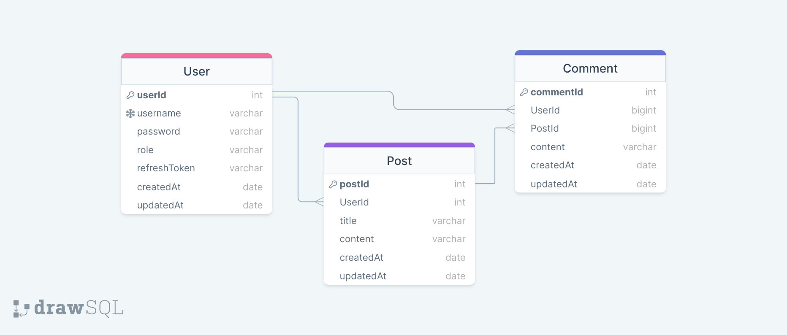

# nodejs 개인과제 Lv. 3

## 개요

기존 과제에서 mongoose로 운영한 database를 MySQL과 sequelize로 전환한다.

## 최종 결과 명세

### ERD



## API 명세

| Path                               | API Method | Verify | Description               |
| ---------------------------------- | ---------- | :----: | ------------------------- |
| /user                              | POST       |        | 회원가입                  |
| /auth/login                        | POST       |        | 로그인                    |
| /user                              | GET        |        | 전체유저조회              |
| /user:userId                       | GET        |        | 개별유저조회              |
| /user:userId/posts                 | GET        |        | 유저가 작성한 게시글 조회 |
| /posts                             | GET        |        | 전체 게시글 조회          |
| /posts                             | POST       |   ✔    | 게시글 작성               |
| /posts/:postId                     | PUT        |   ✔    | 게시글 수정(유저 검증)    |
| /posts/:postId                     | DELETE     |   ✔    | 게시글 삭제(유저 검증)    |
| /posts/:postId/comments            | GET        |        | 게시글 내 댓글 조회       |
| /posts/:postId/comments            | POST       |   ✔    | 게시글 내 댓글 작성       |
| /posts/:postId/comments/:commentId | PUT        |   ✔    | 댓글 수정(유저 검증)      |
| /posts/:postId/comments/:commentId | DELETE     |   ✔    | 댓글 삭제(유저 검증)      |

[상세 API 명세보기](https://ionized-aster-f0c.notion.site/9343a74969704533820ab42c10daa3c9?pvs=4)

## Lv.3 추가 진행사항

> 📌 `TO DO LIST`
>
> - [x] AWS RDS를 활용한 MySQL 데이터베이스 준비
> - [x] ERD 작성하기
> - [x] 기존 mongoose 방식을 sequelize 방식으로 변경
>   - [x] 마이그레이션 파일 수정
>   - [x] controllers의 CRUD 문법을 sequelize 문법으로 수정
> - [x] 에러 문구 모듈화
> - [x] bcrypt를 적용하여 비밀번호 해시 적용

---

## 주요 진행 내역

### Sequelize를 통한 MySQL 마이그레이션

> 🚨 `issue`  
> **_db.migrate:undo_** 명령이 올바로 작동하지 않는 현상 발생

Post테이블과 Comment테이블에서 Constraint와 Index 설정 후 Undo 시 table 삭제 과정에서 오류 발생

```javascript
module.exports = {
  async up(queryInterface, Sequelize) {
    await queryInterface.createTable('Comments', {
      id: {
        allowNull: false,
        autoIncrement: true,
        primaryKey: true,
        type: Sequelize.INTEGER,
      },
      userId: {
        type: Sequelize.INTEGER,
        allowNull: false,
        references: {
          table: 'Users',
          field: 'id',
        },
        onDelete: 'cascade',
      },
    }),
      await queryInterface.addIndex('Comments', ['userId', 'postId']);
  },

  async down(queryInterface, Sequelize) {
    await queryInterface.removeIndex('Comments', ['userId', 'postId']);
    await queryInterface.dropTable('Posts');
  },
};
```

Comments 테이블에서 userId 필드를 foreign key로 설정하기 위해 references 설정을 했고, 추가적으로 addIndex 설정을 해주었다. **_addIndex는 해당 테이블에서 외래 키로 연결된 테이블에과의 조인 작업이나 검색 작업에서 성능 향상에 도움을 준다고 한다._** , Index와 관련한 자세한 성능개선의 근거는 모르겠지만 우선 추가했다. 문제는 undo 과정에서 removeIndex 메서드가 다른 테이블을 참고하는 관계로 인해 테이블 삭제가 안되는 이슈가 발생했다. 초반에 테이블 생성 및 테스트 과정에서 잦은 undo를 수행할 것으로 예상되었기에 이를 해결하고자 했다.

```zsh
npx sequelize db:drop
npx sequelize db:create
```

undo 과정에서 발생하는 문제를 해결하는 동안 위 명령을 통해 db 삭제 및 생성을 반복했다.

최종적으로 addConstraint 메서드를 통해 references를 설정 방식을 변경했고, Constraint와 Index 설정 시 네이밍을 통해 undo과정에서 추가된 기능을 명확히 삭제할 수 있도록 명시하고, 오류가 발생하지 않도록 삭제 순서를 지정했다.  
아래 코드와 같이 수정했다.

```javascript
// foreign key 제약 조건 설정
await queryInterface.addConstraint('Comments', {
  fields: ['userId'],
  type: 'foreign key',
  name: 'fk_comments_user_id',
  references: {
    table: 'Users',
    field: 'id',
  },
  onDelete: 'cascade',
});

// foreign key 설정을 위한 규약 추가
await queryInterface.addConstraint('Comments', {
  fields: ['postId'],
  type: 'foreign key',
  name: 'fk_comments_post_id',
  references: {
    table: 'Posts',
    field: 'id',
  },
  onDelete: 'cascade',
});

// 테이블에 foreign key 대상 multiIndex 추가
await queryInterface.addIndex('Comments', ['userId', 'postId'], {
  name: 'idx_comments_post_id_user_id',
});

async down(queryInterface, Sequelize) {
await queryInterface.removeConstraint('Comments', 'fk_comments_user_id');
await queryInterface.removeConstraint('Comments', 'fk_comments_post_id');
await queryInterface.removeIndex('Comments', 'idx_comments_post_id_user_id');
await queryInterface.dropTable('Comments');
  },
```

기존 방식의 경우 constraint 설정을 삭제하는 과정이 없었고, 또한 constraint의 이름이 명시되어 있지 않아 삭제할 방법도 없었기에 문제가 발생했던 것 같다. 위 문제를 해결하면서 필드별 foreign key 설정 뿐 아니라 addConstraint 메서드로 foreign key를 설정하는 방식도 배울 수 있었다. 하지만 **_최종적으로 addIndex 기능을 추가했을 때의 이점을 명확히 이해하지 못하여 반영하지 않았다._**

---

### mongoose to sequelize

기존 mongoose에서 제대로 반영하지 못했던 관계형 데이터베이스 기반 자동 처리가 sequelize에서 반영되어 코드가 한결 가벼워 졌다.

```javascript
// mongoose 방식
const writePosts = async (req, res) => {
  const { _id } = req.user;

  const { title, content } = req.body;
  const createdPost = await Post.create({ title, content, user: findUser._id });

  // 유저 정보에 유저가 올린 포스팅 정보를 담는다.
  const update = { $push: { posts: createdPost._id } };
  await User.updateOne({ _id }, update);
  res.json({ msg: '게시글 작성 완료' });
};

// sequelize 방식
const writePosts = async (req, res) => {
  const userId = req.user.id;

  const { title, content } = req.body;
  await Post.create({ title, content, userId });
};
```

먼저 mongoose 방식의 코드에서는 유저가 게시글을 작성하면 해당 유저 테이블의 posts 필드에도 방금 생성한 게시글 id를 따로 등록해줘야 했다. 해당 유저 정보를 조회했을 때 어떤 게시글을 작성한 이력이 있는지 기록을 남기기 위해서였다.

하지만 sequelize에서는 User 테이블의 id 필드와 Post 테이블의 userId 필드를 one to many로 설정해 두었기 때문에 Post 테이블에서 작성자의 userId에 대한 정보만 남겨 둔다면 추후 JOIN 쿼리를 통해 조회가 가능하므로 User 테이블에서의 추가 수정은 필요하지 않다.

> `Why❓`

```javascript
// User 다큐먼트에 추가된 posts 객체
posts: [
      {
        type: mongoose.Schema.Types.ObjectId,
        ref: 'Post',
      },
    ],
```

mongoose는 RDBMS가 아니므로 foreign key와 비슷한 개념을 활용하기 위해서는 아래 코드와 같이 참조용 프로퍼티를 보유해야 하고, 게시글 작성 시 유저 다큐먼트에 게시글 id 정보를 따로 기록해야 참조가 가능해지기 때문이다.

```javascript
// 유저 모델과 포스트 모델 간 1대 다 관계 설정

// models/user.js
static associate(models) {
  this.hasMany(models.Post, {
    sourceKey: 'id',
    foreignKey: 'userId',
  });
}

// models/post.js
static associate(models) {
  this.belongsTo(models.User, {
    targetKey: 'id',
    foreignKey: 'userId',
});
}
```

반면 sequelize는 두 모델 간 관계를 위 코드와 같이 연결하여 JOIN 쿼리가 작동할 수 있게 한다.

```javascript
// mongoose (updatedAt 시간을 직접 최신화 하고 있다.)
const update = { $set: { title, content, updatedAt: Date.now() } };
await Post.updateOne(findPost, update);

// sequelize
const update = { title, content };
await Post.update(update, { where: { id: postId } });
```

또한 게시글 수정 시 updatedAt 또한 자동으로 반영되므로 해당 부분을 신경 쓸 필요가 없게 되었다.

---

#### mongoose와 sequelize의 JOIN 방식

```javascript
// mongoose
const getPosts = async (req, res) => {
  const getPosts = await Post.find({})
    .populate({
      path: 'user',
      select: '-refreshToken -createdAt -updatedAt',
    })
    .sort({ _id: -1 });
};

// sequelize
const getPosts = async (req, res) => {
  const getPosts = await Post.findAll({
    attributes: {
      exclude: ['userId'],
    },
    include: [
      {
        model: User,
        attributes: ['id', 'username', 'role'],
      },
    ],
    order: [['createdAt', 'DESC']],
  });
};
```

게시글 조회 시 mongoose는 populate라는 메서드를 통해 Post document에 등록된 userId를 참고하여 해당 유저 정보를 함께 가져오는 형태를 취한다.

sequelize의 경우는 RDBMS답게 include라는 JOIN 쿼리를 통해 두 테이블을 조합하는 형태를 취한다. 다시 한 번 말하지만 include의 model: User를 설정하여 올바로 동작하게 하기 위해서는 관계를 지닌 두 모델에 hasMany(또는 hasOne)와 belongsTo 메서드가 사전에 적용되어야 한다.

#### CRUD 메서드 변경내역

| mongoose  | sequelize |
| --------- | --------- |
| find      | findAll   |
| findOne   | findOne   |
| findById  | findByPk  |
| create    | create    |
| updateOne | update    |
| deleteOne | destroy   |
| sort      | order     |

---

### 비밀번호 해싱 처리

회원가입 시 유저의 비밀번호가 데이터베이스에 그대로 노출되지 않도록 해싱 처리 후 저장합니다.

해싱 처리를 위한 패키지를 설치합니다.

```zsh
npm install bcrypt
```

user모델에서 User.init 아래 아래 메서드를 추가해줍니다. 이로서 유저 생성 전 비밀번호의 해싱 처리가 이루어 집니다.  
`bcrypt` 패키지를 사용하고, saltRounds를 10으로 입력해서 해싱 암호를 좀 더 강화합니다.

```javascript
// user.js
const bcrypt = require('bcrypt');
User.beforeCreate(async (user) => {
  const saltRounds = 10;
  const hashedPassword = await bcrypt.hash(user.password, saltRounds);
  console.log(hashedPassword);
  user.password = hashedPassword;
});
```

해싱 적용을 위해 마이그레이션 파일을 일부 수정했습니다. 기존에는 비밀번호 길이 제약을 위해 STRING(20) 객체를 생성했었는데 이를 255로 변경하고 추가로 BINARY를 추가했습니다. 길이 제한을 두면 해싱 암호가 잘려서 저장되므로 인증 과정에서 일치 검증이 불가해 집니다.

```javascript
password: {
        type: Sequelize.STRING.BINARY,
        allowNull: false,
        validate: {
          len: {
            args: [4, 20],
            msg: '최소 4자 이상 입력해야 합니다.',
          },
          is: {
            args: /^[a-zA-Z0-9!@#$%^&*()]+$/,
            msg: '영문 대소문자, 숫자, 특수기호만 입력이 가능합니다.',
          },
        },
      },
```

마지막으로 로그인 기능에서 비밀번호 검증을 위한 코드를 아래와 같이 추가해 줍니다.

```javascript
// 암호 확인
const isPasswordValid = await bcrypt.compare(password, findUser.password);
if (!isPasswordValid)
  return res.status(errors.passwordWrong.status).send({ msg: errors.passwordWrong.msg });
```

compare 메서드를 통해 body로 입력받은 비밀번호와 데이터베이스에 저장된 해싱 암호의 일치를 비교합니다.

---

### 에러메시지 모듈화

에러메시지가 동일한 상황에서도 다른 메시지 형태로 전달하는 경우가 많아서 모듈화 하여 일관성을 유지할 수 있도록 조치하였다.

```javascript
class ErrorMessage {
  constructor(status, msg) {
    this.status = status;
    this.msg = msg;
  }
}

const errors = {
  noUser: new ErrorMessage(404, '해당 유저 정보가 존재하지 않습니다.'),
  noPost: new ErrorMessage(404, '해당 게시글이 존재하지 않습니다.'),
  noComment: new ErrorMessage(404, '해당 댓글이 존재하지 않습니다.'),

  notUser: new ErrorMessage(401, '회원이 아닙니다.'),
  existUser: new ErrorMessage(412, '해당 아이디가 이미 존재합니다.'),
  passwordDiff: new ErrorMessage(412, '패스워드와 패스워드 확인이 일치하지 않습니다.'),
  nameInPassword: new ErrorMessage(412, '닉네임 정보를 비밀번호에 적용할 수 없습니다.'),

  noCookie: new ErrorMessage(403, '엑세스 토큰 검증을 위한 쿠키 없음 (재 로그인 필요)'),
  expiredRefresh: new ErrorMessage(403, '리프레시 토큰이 만료됨 (재 로그인 필요)'),
  cantChangePost: new ErrorMessage(403, '해당 게시글의 수정 권한이 없습니다.'),
  cantChangeComment: new ErrorMessage(403, '해당 댓글의 수정 권한이 없습니다.'),
};

module.exports = errors;
```

ErrorMessage라는 클래스에 객체 형태로 status와 message를 담는 방식으로 간단하게 구성하여 신규 에러 메시지 생성 시 간단하게 추가할 수 있도록 구현하였다.

```javascript
// Before
if (!findUser) return res.status(404).send({ msg: '해당 유저 정보가 존재하지 않습니다.' });
// After
const errors = require('../static/errors');
if (!findUser) return res.status(errors.noUser.status).send({ msg: errors.noUser.msg });
```

위와 같이 적용 가능하며 만일 메시지 또는 status의 변경이 필요할 경우 일괄 적용이 가능하다는 장점이 있다.  
하지만 데이터베이스 상태가 원활하지 못하거나, 일시적인 오류로 쿠키를 가져오지 못하는 등에 대한 오류에 대해서는 try, catch문으로 적용 중이며, 해당 문제에 대한 에러 케이스는 한가지로 정의할 수 없기에 status와 문구를 고정적으로 설정하지 않고 아래와 같이 사용 중에 있다.

```javascript
// 유저 조회
const getUsers = async (req, res) => {
  try {
    const findUsers = await User.findAll({
      attributes: {
        exclude: ['password', 'refreshToken'],
      },
    });

    res.send(findUsers);
  } catch (err) {
    console.error(err.name, ':', err.message);
    return res.status(400).send({ msg: `${err.message}` });
  }
};
```

데이터베이스와의 통신 문제로 findAll 메서드가 원활히 동작하지 않을 경우 catch로 이동하며, 해당 에러에서 획득한 name과 message를 출력하도록 구현하였다.

---

### 데이터베이스 접속 정보 보호 (config.json)

config.json파일에 MySQL 접속을 위한 username, password, host 정보가 담겨있다. 이를 dotenv 모듈을 사용하여 숨김처리하고 싶지만 json파일에 자바스크립트 코드를 명령할 수는 없다. 그래서 config.json파일을 대체할 파일이 필요하다.  
아래 코드는 json파일을 js파일로 변환한 결과이다. github에 올리는 것을 방지하기 위해 아래와 같은 파일 전환이 필요하다.

```javascript
// config.js
require('dotenv').config();

const development = {
  username: process.env.MYSQL_USERNAME,
  password: process.env.MYSQL_PASSWORD,
  database: process.env.MYSQL_DATABASE,
  host: process.env.MYSQL_HOST,
  dialect: 'mysql',
};

const test = {
  username: 'root',
  password: null,
  database: 'database_test',
  host: '127.0.0.1',
  dialect: 'mysql',
};

const production = {
  username: 'root',
  password: null,
  database: 'database_production',
  host: '127.0.0.1',
  dialect: 'mysql',
};

module.exports = { development, test, production };
```

또한 기존 json파일을 활용했던 models/index.js 파일에서도 json이 아닌 js파일을 가져올 수 있도록 아래와 같이 수정이 필요하다.

```javascript
const config = require(__dirname + '/../config/config.js')[env];
```

이와 같이 js파일을 불러오도록 경로를 변경하였다.
